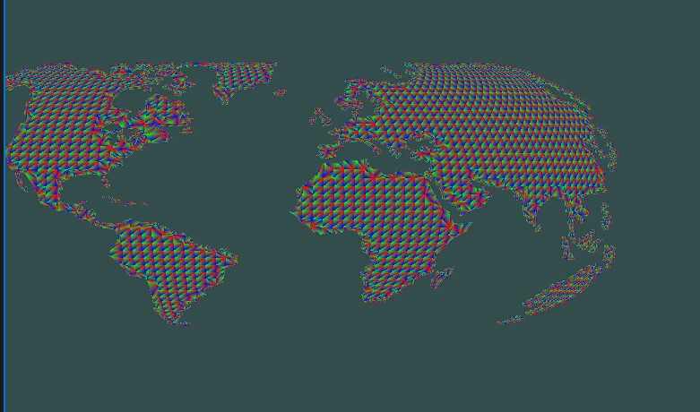
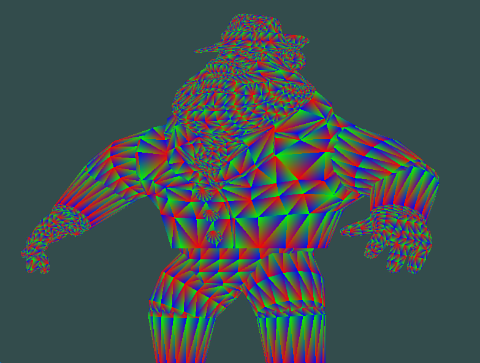

Resources Used:
learnOpenGl.com

# OpenGLViewer
[Link to Repository](https://github.com/haroonsyed/OpenGLViewer)

## Made in CAP4730: Computer Graphics at the University of Florida
### Under Dr. Aleirza Entezari


### Features
- Animated/Rotating View
- GPU side mesh rendering
- Separate Vertex and Fragment Shader files
- Color interpolation between vertices on face
- Loading obj files (and breaking n-gon into tris)


### Technologies Used
- GLFW
- OPENGL
- VCPKG
- GLM
- C++
- Fundamentals of Computer Graphics 3rd Edition
- WSL2
- CMAKE

### Compilation Instructions
**Windows**
1. Clone this repo using <br>
`git clone https://github.com/haroonsyed/OpenGLViewer.git --recursive`
2. Install cmake
3. Open the folder containing repo in visual studio, run main.cpp

    or

3. CD into build folder and run `cmake ..`
4. Open generated solution (in build folder) in visual studio and run main.cpp

**Linux**
1. Clone this repo using <br>
`git clone https://github.com/haroonsyed/OpenGLViewer.git --recursive`
2. Install the following dependencies: 
libxmu-dev libxi-dev libgl-dev libxinerama-dev libxcursor-dev xorg-dev libglu1-mesa-dev
3. Install cmake
4. CD into build folder and run `cmake ..`
5. Run `make` to build your executable
6. Run `./main` 

### Operation Guide
Change filepath in `config.h` to change obj file loaded in viewer.
Change bool `useSeparateTriangles` to switch between separate and indexed tri structure.

## Functionality
### Changing Face and Per-Vertex Color


Currently changing color requires changing the code for mesh importing in `readMesh()` where color data is interpolated with vertex position.

### Different Meshes (Separate Tris)






The algorithm for breaking down a mesh seemed daunting. But a little bit of pencil and paper work showed all I had to do was connect every vertex from the first with increments for the second and third vertex. (Work below)

Which translates to the following psuedocode:
```
// Loop breaks n-gons into tris
for (int i = 0; i < face.size() - 3; i++) {

    // Get each position (list of 3 coordinates)
    v1 = getIndexedPosition(vIndex, 1 - 1);
    v2 = getIndexedPosition(vIndex, (i+2) - 1);
    v3 = getIndexedPosition(vIndex, (i+3) - 1);
```

<br>
To keep the mesh within the viewplane I simply had to normalize the vertex list by the maximum coordinate of all vertices.

### File Reading
For the rest of the assignment, much of the work was simply reading files and using the correct delimiter.
For this I used `fstream` with `getline()`
The code for this can be seen in `readMesh` and `readMesh` of `MeshImporter` class. As well as `readShader` of the shaderImporter class.

<br>

### Outside Help
I mainly relied on https://learnopengl.com/ and the class lecture notes to understand what/how to do matrix transformations and work with shaders.


I also used https://docs.gl/ to see information regarding the opengl library.

## Assignment Requriements Checklist:
| Feature | Status | Extra Desc. |
| ---------------------------------- | --------- | ------------------ |
| Modify vertex and frag shader to support color data | :white_check_mark: | |
| Load meshes from obj files | :white_check_mark: | Breaks down n-gons into tris |
| Load vertex and frag shaders from files (.vs and .fs) | :white_check_mark: | |
| Make change to vertex/frag shader | :white_check_mark: | Passed model transformation matrix to rotate model as a function of time |
| Bonus: Implement EBO with indexed triangle structure | :x: | |
| Documentation | :white_check_mark: | | 