# OpenGLViewer
[Link to Repository](https://github.com/haroonsyed/OpenGLViewer)

## Made in CAP4730: Computer Graphics at the University of Florida
### Under Dr. Aleirza Entezari

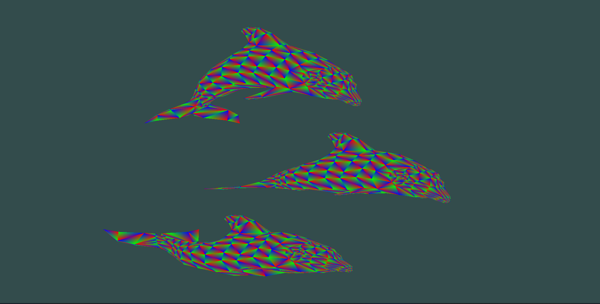

### Features
- GPU side rendering
- Separate Vertex and Fragment Shader files
- Color interpolation between vertices on face
- Loading obj files (and breaking n-gon into tris)
- Animated/Rotating View
- Scaling with button input
- Mouse interaction to rotate object in view
- Phong, Gouraud lighting and Depth shaders


### Technologies Used
- GLFW
- OPENGL
- VCPKG
- GLM
- C++
- Fundamentals of Computer Graphics 3rd Edition
- WSL2
- CMAKE

### Compilation Instructions
**Windows**
1. Clone this repo using <br>
`git clone https://github.com/haroonsyed/OpenGLViewer.git --recursive`
2. Install cmake
3. Open the folder containing repo in visual studio, run main.cpp

    or

3. CD into build folder and run `cmake ..`
4. Open generated solution (in build folder) in visual studio and run main.cpp

**Linux**
1. Clone this repo using <br>
`git clone https://github.com/haroonsyed/OpenGLViewer.git --recursive`
2. Install the following dependencies: 
libxmu-dev libxi-dev libgl-dev libxinerama-dev libxcursor-dev xorg-dev libglu1-mesa-dev
3. Install cmake
4. CD into build folder and run `cmake ..`
5. Run `make` to build your executable
6. Run `./main` 

### Common Error
The path between visual studio and using cmake/make directly will differ. Make sure the `filepath` in `config.h` is valid or the program will crash with an error. (I have not implemented error reports for this.)

### Operation Guide
Change filepath in `config.h` to change obj file loaded in viewer.
Change the shader name for fragment and vertex shader to change shader.
Change resolution using width and height.
To zoom in the view, press `z`. To zoom out press `x`.
Use mouse to rotate object in the viewer, default rotation animation will stop during this time.

## Functionality
### Changing Face and Per-Vertex Color
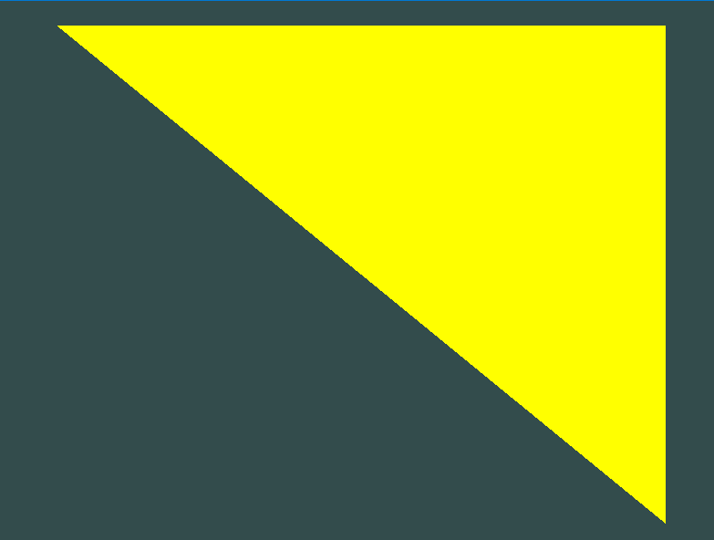
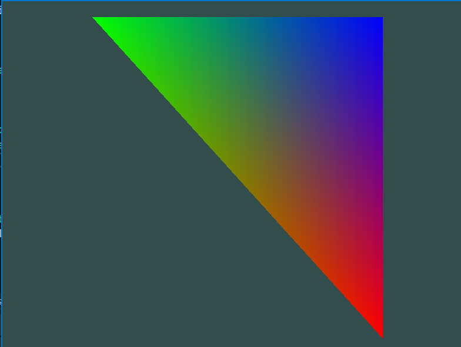
Currently changing color requires changing the code for mesh importing in `readMesh()` where color data is interpolated with vertex position.

### Convert from n-gon to tri
The algorithm for breaking down a mesh seemed daunting. But a little bit of pencil and paper work showed all I had to do was connect every vertex from the first with increments for the second and third vertex. (Work below)
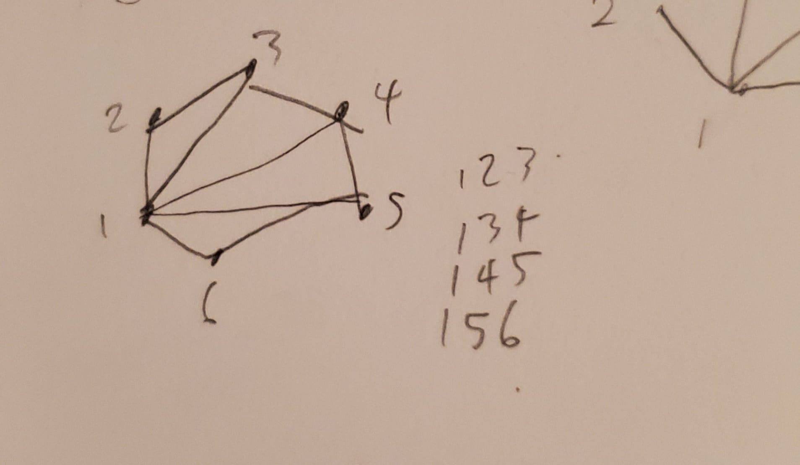
Which translates to the following psuedocode:
```
// Loop breaks n-gons into tris
for (int i = 0; i < face.size() - 3; i++) {

    // Get each position (list of 3 coordinates)
    v1 = getIndexedPosition(vIndex, 1 - 1);
    v2 = getIndexedPosition(vIndex, (i+2) - 1);
    v3 = getIndexedPosition(vIndex, (i+3) - 1);
```

### Normalizing meshes to stay in view
To keep the mesh within the viewplane I simply had to normalize the vertex list by the maximum coordinate of all vertices.

### Rotating Animation in View
The code for this is based on learnopengl's tutorial at https://learnopengl.com/Getting-started/Coordinate-Systems. Although modified and pretty easy to understand.
All I had to do was define a glm rotation vector and pass this to my vertex shader, where the model matrix is multiplied by the original mesh's position matrix.

### File Reading
For the rest of the assignment, much of the work was simply reading files and using the correct delimiter.
For this I used `fstream` with `getline()`.
The code for this can be seen in `readMesh()` and `delimit()` of `MeshImporter` class. As well as `readShader` of the shaderImporter class.

## Examples with Included Shaders
### No Lighting

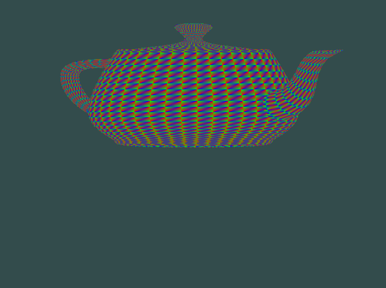
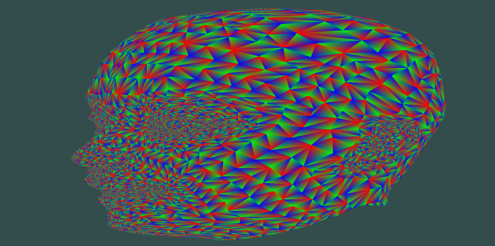
### Depth Shader
Note how points further back in the scene appear lighting. 
I like how the shader gives the objects a transluscent effect as well, maybe useful for water.

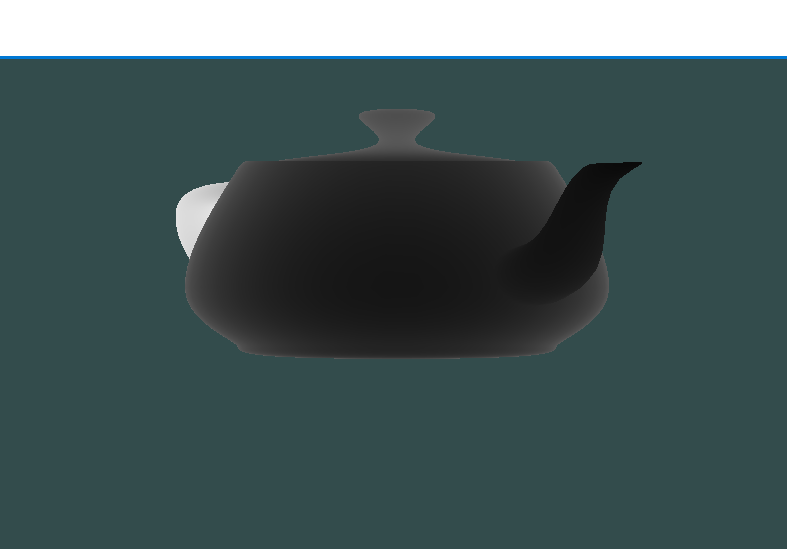
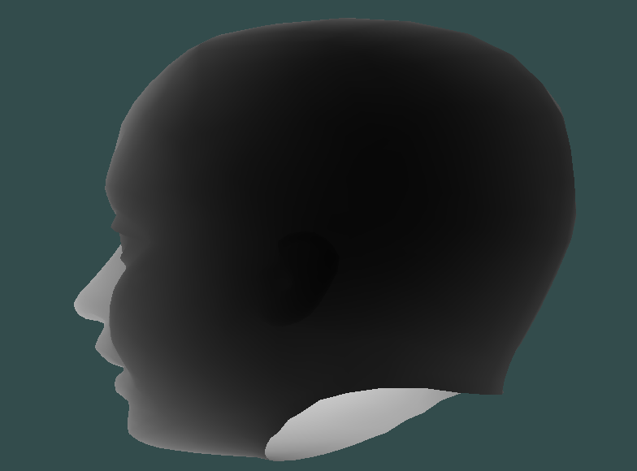
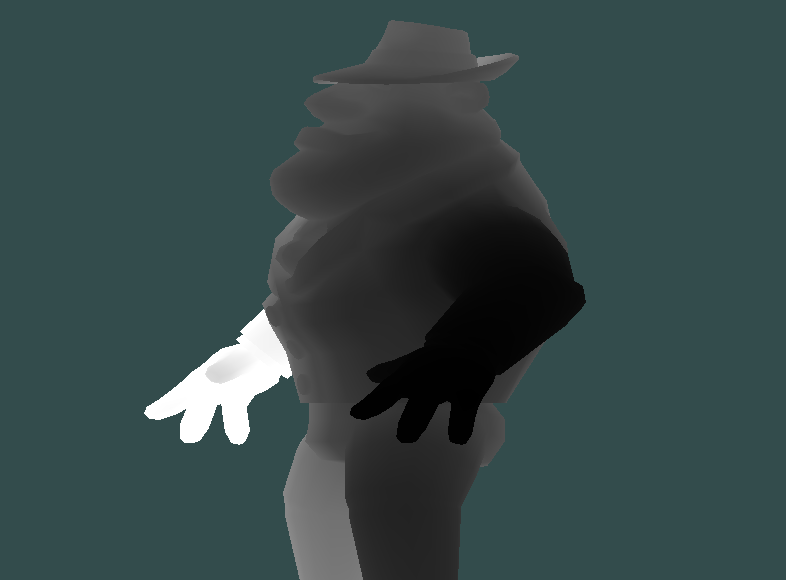
### Gouraud Lighting
Not how the soccerball highlight looks jagged and strange compared to the 
smoothly interpolated normals of the phong shading.
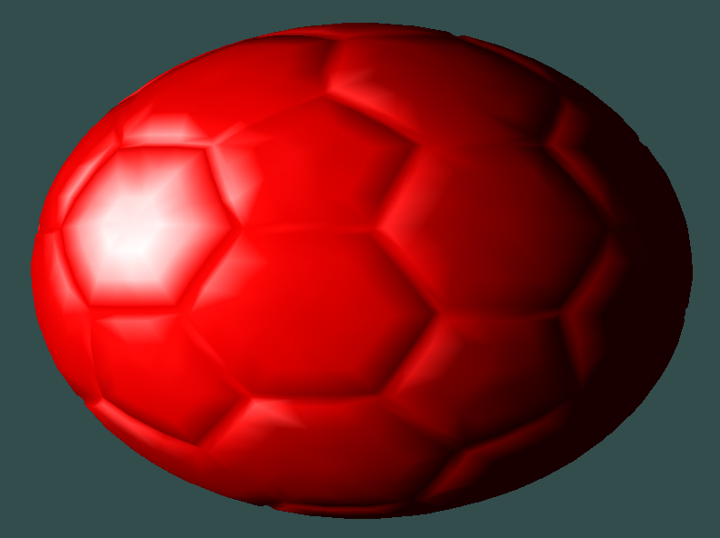

### Phong Lighting
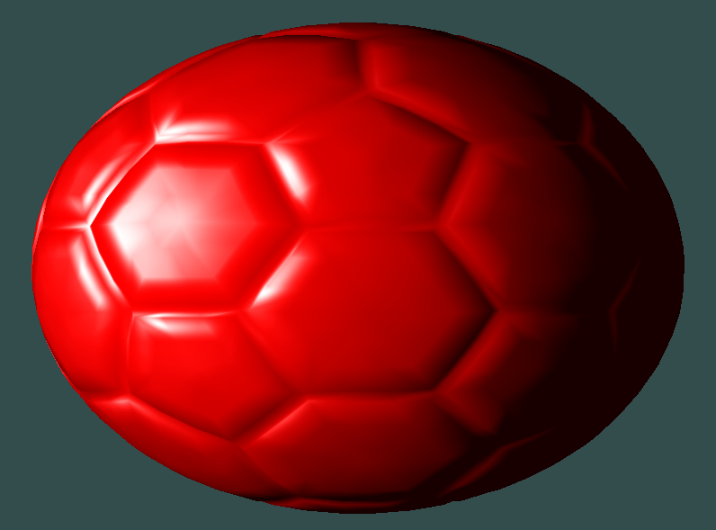

<br>

## Videos
Below is a video of what the viewer looks like when open:<br>
https://youtu.be/L00kfk67emE

Below is a video of interacting with the viewport (scaling and mouse rotation):<br>


## Outside Help
I mainly relied on https://learnopengl.com/ and the class lecture notes to understand what/how to do matrix transformations and work with shaders.
<br>
I also used https://docs.gl/ to see information regarding the opengl library.

## Assignment Requriements Checklist (Part 1):
| Feature | Status | Extra Desc. |
| ---------------------------------- | --------- | ------------------ |
| Modify vertex and frag shader to support color data | :white_check_mark: | |
| Load meshes from obj files | :white_check_mark: | Breaks down n-gons into tris |
| Load vertex and frag shaders from files (.vs and .fs) | :white_check_mark: | |
| Make change to vertex/frag shader | :white_check_mark: | Passed model transformation matrix to rotate model as a function of time |
| Bonus: Implement EBO with indexed triangle structure | :x: | |
| Documentation | :white_check_mark: | | 

## Assignment Requirements Checklist (Part 2):
| Feature | Status | Extra Desc. |
| ---------------------------------- | --------- | ------------------ |
| Scale up and down object in viewer | :white_check_mark: | Uses 'z' and 'x' buttons |
| Rotation Functionality | :white_check_mark: | |
| Z buffer shader | :white_check_mark: | Load "depthShader.fs" and "depthShader.vs" |
| Add Gouraud and Phong shading to the scene | :white_check_mark: | Generated normals sometimes face the wrong way |
| Bonus: Implemented mouse input by clicking and rotating with left click | :white_check_mark: | |
| Documentation | :white_check_mark: | | 

## DISCLAIMER
THIS IS ONLY FOR SUBMISSION/DEMONSTRATION PURPOSES AND IS NOT FOR OTHER STUDENTS TAKING THE CLASS. 

I DO NOT AUTHORIZE THE USE OF THIS CODE FOR CLASS PURPOSES BY ANY STUDENT OTHER THAN MYSELF OR IN ANY FORM THAT WOULD BE CONSIDERED "CHEATING" OR "PLAGARISM". 

Please be ethical.